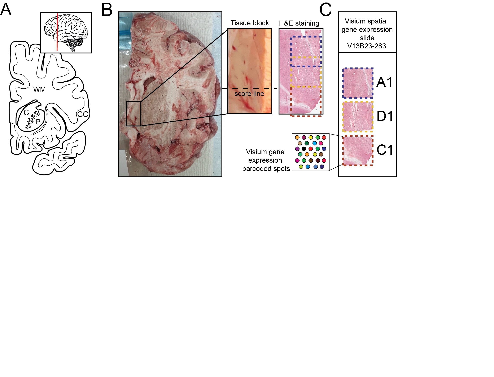
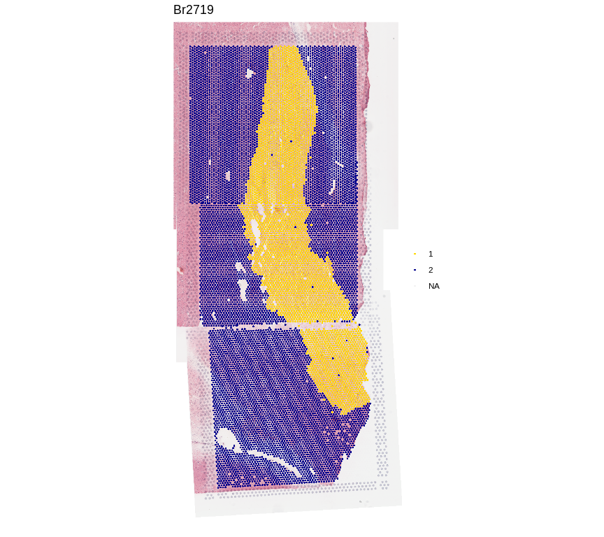

visiumStitched_brain
================

<!-- README.md is generated from README.Rmd. Please edit that file -->

[](https://zenodo.org/doi/10.5281/zenodo.13014172)

## Overview

This repository contains the data used to demonstrate the utility of
[`visiumStitched`](https://github.com/LieberInstitute/visiumStitched).
Three
[Visium](https://www.10xgenomics.com/products/spatial-gene-expression)
capture areas were collected from the postmortem human brain from one
donor. We used [Fiji](https://imagej.net/software/fiji/) and
`visiumStitched` to stitch the gene-expression and imaging data into one
sample for downstream analysis.

If you tweet about this website, the data or the R package please use
the <code>\#visiumStitched</code> hashtag. You can find previous tweets
that way as shown
<a href="https://twitter.com/search?q=%23visiumStitched&src=typed_query">here</a>.

Thank you for your interest in our work!

## Study Design



**Figure 1. Experimental design to generate spatially-resolved
transcriptomics (SRT) data from postmortem human brain across three
Visium capture areas.**

**(A)** Schematics illustrating a coronal human brain hemisphere at the
level of the anterior striatum. Inset showing an illustration of the
lateral side of the brain with a vertical red line depicting the
location of the coronal slab. CC – cerebral cortex, C – caudate nucleus,
P – putamen, WM – white matter. **(B)** Raw coronal brain slab,
dissected tissue block with an indicated score line, and H&E staining of
the 10 µm section taken from the same block. **(C)** A diagram depicting
how tissue sections were arranged on the Visium slide with capture
arrays A1 (blue) and D1 (yellow) arranged partially overlapping, while
capture arrays D1 (yellow) and C1 (red) arranged adjacent to each other
across a score line.

## Introductory Material

Here is a short overview video of the stitching steps performed with
[`Fiji`](https://imagej.net/software/fiji/).

<iframe width="560" height="315" src="https://www.youtube.com/embed/kFLtpK3qbSY?si=u6bIKY5U9yccx62R" title="YouTube video player" frameborder="0" allow="accelerometer; autoplay; clipboard-write; encrypted-media; gyroscope; picture-in-picture; web-share" referrerpolicy="strict-origin-when-cross-origin" allowfullscreen data-external="1">
</iframe>

Check out [this
guide](https://research.libd.org/visiumStitched/articles/visiumStitched.html)
describing how to use `visiumStitched` with the outputs of `Fiji`, which
enabled the integration of all three capture areas for this project.
This resulted in a
[`SpatialExperiment`](https://doi.org/10.1093/bioinformatics/btac299)
object that can be used seamlessly for downstream analyses steps, such
as performing spatially-aware clustering with tools such as
[`BayesSpace`](https://doi.org/10.1038/s41587-021-00935-2) and
[`PRECAST`](https://doi.org/10.1038/s41467-023-35947-w).

## Interactive Websites

Explore the stitched example data using the [interactive
website](https://libd.shinyapps.io/visiumStitched_brain), powered by
[spatialLIBD](https://doi.org/10.1186/s12864-022-08601-w).

Alternatively, you may choose to run the interactive website locally
with
[`spatialLIBD::run_app()`](http://research.libd.org/spatialLIBD/reference/run_app.html),
which gives more freedom regarding memory usage and session length. See
[this
example](https://github.com/LieberInstitute/visiumStitched_brain/blob/devel/code/05_shiny/app.R)
for invoking `spatialLIBD::run_app()` with an appropriate set of
arguments.

# Data Access

## R Objects

For this human brain dataset composed of 3 Visium capture areas, the
transcriptomics data,
[`SpaceRanger`](https://www.10xgenomics.com/support/software/space-ranger/latest/analysis/running-pipelines/space-ranger-count)
outputs, and [`Fiji`](https://imagej.net/software/fiji/) outputs are all
available through `spatialLIBD::fetch_data()` (version 1.17.8 or newer).
A comprehensive vignette using these objects is written
[here](https://research.libd.org/visiumStitched/articles/visiumStitched.html).

``` r
## Check that you have a recent version of spatialLIBD installed
stopifnot(packageVersion("spatialLIBD") >= "1.17.8")

## Download the spot-level data, which is a SpatialExperiment object
spe <- spatialLIBD::fetch_data(type = "visiumStitched_brain_spe")
#> 2024-08-07 14:45:01.414072 loading file /Users/leocollado/Library/Caches/org.R-project.R/R/BiocFileCache/1769558ae4ac_visiumStitched_brain_spe.rds%3Frlkey%3Dnq6a82u23xuu9hohr86oodwdi%26dl%3D1
spe
#> class: SpatialExperiment 
#> dim: 26369 13965 
#> metadata(0):
#> assays(2): counts logcounts
#> rownames(26369): ENSG00000238009 ENSG00000241860 ... ENSG00000278817
#>   ENSG00000277196
#> rowData names(7): source type ... gene_type gene_search
#> colnames(13965): AAACAACGAATAGTTC-1_V13B23-283_A1
#>   AAACAAGTATCTCCCA-1_V13B23-283_A1 ... TTGTTTGTATTACACG-1_V13B23-283_D1
#>   TTGTTTGTGTAAATTC-1_V13B23-283_D1
#> colData names(43): sample_id in_tissue ... precast_k16_unstitched
#>   precast_k24_unstitched
#> reducedDimNames(1): PCA
#> mainExpName: NULL
#> altExpNames(0):
#> spatialCoords names(2) : pxl_col_in_fullres pxl_row_in_fullres
#> imgData names(4): sample_id image_id data scaleFactor

## Show clustering results from PRECAST at k = 2
spatialLIBD::vis_clus(
    spe,
    clustervar = 'precast_k2_stitched',
    is_stitched = TRUE,
    colors = c(
        "1" = "gold",
        "2" = "darkblue",
        "NA" = "white"
    )
)
```



## Raw data

The source data described in this manuscript are available from
[Globus](http://research.libd.org/globus/)
(`jhpce#visiumStitched_brain`). This includes all the input FASTQ files
as well as the outputs from
[`SpaceRanger`](https://support.10xgenomics.com/spatial-gene-expression/software/pipelines/latest/what-is-space-ranger).

# Citing Our Work

Below is the citation output from using `citation('visiumStitched')` in
R. Please run this yourself to check for any updates on how to cite
**visiumStitched**.

``` r
print(citation("visiumStitched")[2], bibtex = TRUE)
#> Eagles NJ, Bach S, Tippani M, Ravichandran P, Du Y, Miller RA, Hyde TM,
#> Page SC, Martinowich K, Collado-Torres L (2024). "visiumStitched."
#> _bioRxiv_. doi:10.1101/TODO <https://doi.org/10.1101/TODO>,
#> <https://www.biorxiv.org/content/10.1101/TODO>.
#> 
#> A BibTeX entry for LaTeX users is
#> 
#>   @Article{,
#>     title = {visiumStitched},
#>     author = {Nicholas J. Eagles and Svitlana Bach and Madhavi Tippani and Prashanthi Ravichandran and Yufeng Du and Ryan A. Miller and Thomas M. Hyde and Stephanie C. Page and Keri Martinowich and Leonardo Collado-Torres},
#>     year = {2024},
#>     journal = {bioRxiv},
#>     doi = {10.1101/TODO},
#>     url = {https://www.biorxiv.org/content/10.1101/TODO},
#>   }
```

Please note that `visiumStiched` was only made possible thanks to many
other R and bioinformatics software authors, which are cited either in
the vignettes and/or the paper(s) describing the package.

### Cite `spatialLIBD`

Below is the citation output from using `citation('spatialLIBD')` in R.
Please run this yourself to check for any updates on how to cite
**spatialLIBD**.

``` r
print(citation("spatialLIBD")[1], bibtex = TRUE)
#> Pardo B, Spangler A, Weber LM, Hicks SC, Jaffe AE, Martinowich K,
#> Maynard KR, Collado-Torres L (2022). "spatialLIBD: an R/Bioconductor
#> package to visualize spatially-resolved transcriptomics data." _BMC
#> Genomics_. doi:10.1186/s12864-022-08601-w
#> <https://doi.org/10.1186/s12864-022-08601-w>,
#> <https://doi.org/10.1186/s12864-022-08601-w>.
#> 
#> A BibTeX entry for LaTeX users is
#> 
#>   @Article{,
#>     title = {spatialLIBD: an R/Bioconductor package to visualize spatially-resolved transcriptomics data},
#>     author = {Brenda Pardo and Abby Spangler and Lukas M. Weber and Stephanie C. Hicks and Andrew E. Jaffe and Keri Martinowich and Kristen R. Maynard and Leonardo Collado-Torres},
#>     year = {2022},
#>     journal = {BMC Genomics},
#>     doi = {10.1186/s12864-022-08601-w},
#>     url = {https://doi.org/10.1186/s12864-022-08601-w},
#>   }
```

## Internal

- JHPCE location:
  `/dcs05/lieber/lcolladotor/visiumStitched_LIBD1070/visiumStitched_brain`.

The code in this repository follows the organization from
<https://github.com/LieberInstitute/template_project> following the
guidelines from
[organizing-your-work](https://lcolladotor.github.io/bioc_team_ds/organizing-your-work.html#.YzL43uzMKX0).
